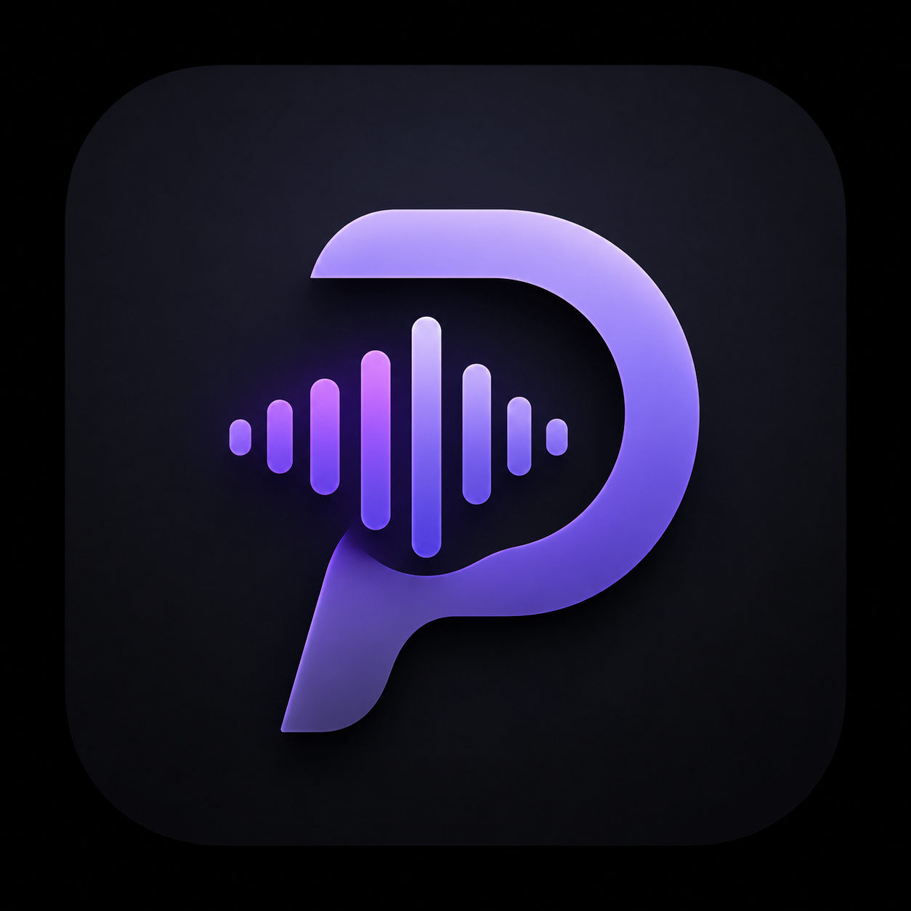

<div align="center">



# PITCH

**Push-to-talk dictation for Windows — hold a shortcut, speak, release, and your words are typed anywhere.**

[](https://github.com/Ronak-jain-afk/Pitch/releases/latest)


[Download the latest installer](https://github.com/Ronak-jain-afk/Pitch/releases/latest) · [Report a bug](https://github.com/Ronak-jain-afk/Pitch/issues)

</div>

---

PITCH works in **every app** — Slack, Notion, your browser, your IDE. Hold the hotkey, speak naturally, release. A few seconds later your words are pasted at the cursor, cleaned up and punctuated.

## Highlights

- **Push-to-talk everywhere** — global hotkey works over any app, implemented with a low-level keyboard hook that never swallows your keys or triggers the Start menu. Pick **Ctrl+Win**, **Caps Lock**, or **F9**, with hold-to-talk or toggle activation
- **Two transcription engines**
  - **Local (Parakeet)** — NVIDIA's Parakeet TDT runs on-device via ONNX. Offline, private, no per-use cost, one-click download from Settings
  - **Cloud (Groq)** — Whisper large-v3 turbo, extremely fast, used automatically as fallback whenever local fails
- **Local AI polish (opt-in)** — a tiny on-device model (Qwen2.5-0.5B, ~490 MB one-time download) fixes grammar, punctuation, and leftover fillers before your dictionary rules apply. Fully offline
- **Voice commands** — say "scratch that" to undo the last dictation; "new line" / "new paragraph" for layout while dictating
- **Clipboard-safe paste** — dictating never destroys what you had on your clipboard, and your previous clipboard is restored after the paste lands
- **Dictionary & Snippets** — teach PITCH your vocabulary ("get hub" → *GitHub*) and expand spoken cues into full text ("my linkedin" → your profile URL)
- **Filler-word removal** — opt-in regex pass strips "um", "uh", "hmm" without any model
- **Transcript history** — everything you dictate is saved locally, searchable by day, click-to-copy, keyboard-navigable
- **Light & dark themes**, system tray living, launch-on-login

## How it works

1. Hold the hotkey (default <kbd>Ctrl</kbd> + <kbd>Win</kbd>) — a pill appears at the bottom of your screen
2. Speak naturally, at your own pace
3. Release — PITCH transcribes and pastes at your cursor

## Install

1. Grab **`PITCH_x.y.z_x64-setup.exe`** from the [latest release](https://github.com/Ronak-jain-afk/Pitch/releases/latest)
2. Install (per-user, no admin required)
3. Optional: paste a [Groq API key](https://console.groq.com/keys) in Settings → cloud engine + fallback
4. Optional: hit **Download** under Local engine (~660 MB, one time) for offline dictation
5. Optional: enable **AI polish** and download the tiny grammar model (~490 MB, one time)

> The installer is ~9 MB because the speech models are downloaded on demand instead of shipped inside it.

## Privacy

- **Local mode**: audio never leaves your machine.
- **AI polish**: runs entirely on-device — text never leaves your machine either.
- **Cloud mode**: audio is sent to Groq's API for transcription only.
- History, dictionary, and config live in `%APPDATA%\com.ronak.pitch` on your disk.

## Building from source

Prerequisites: [Rust](https://rustup.rs), Node.js 18+, [NSIS dependencies handled by Tauri](https://tauri.app/start/prerequisites/).

```powershell
git clone https://github.com/Ronak-jain-afk/Pitch.git
cd Pitch
npm install
npm run tauri dev      # develop
npm run tauri build    # produce the installer
```

The local speech model isn't stored in git — download it from Settings on first run.

## Tech stack

Rust · [Tauri 2](https://tauri.app) · sherpa-onnx (Parakeet TDT) · llama.cpp (Qwen2.5-0.5B polish) · cpal · whisper via [Groq](https://groq.com) · vanilla JS webview UI

## License

[MIT](LICENSE)
